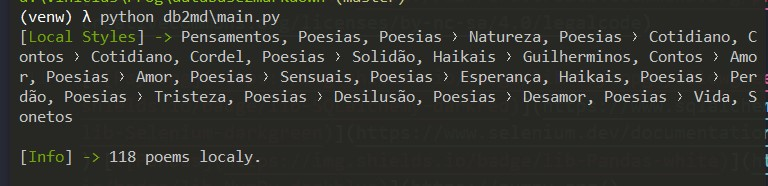
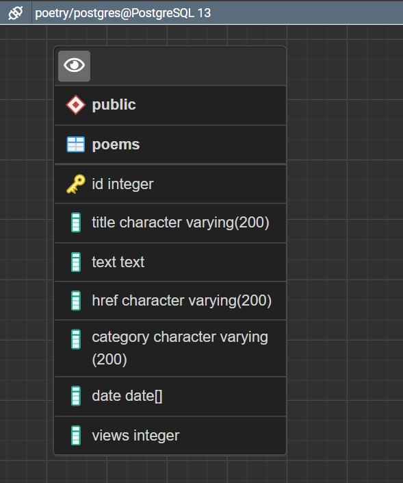

## 🐍✨ Python Write Markdown Poetry 📓✒
### [Leia em Português aqui](README.md).

Python database access and file manipulation project.

[](https://creativecommons.org/licenses/by-nc-sa/4.0/legalcode)

[](https://www.psycopg.org/) [](https://www.sqlalchemy.org/) [](https://pandas.pydata.org/)



## Features

 - Create folders for each poetry category in the database;
 - Creates .md files with the following database information:
   - Title;
   - Text content;
   - URL to text;
   - Category;
   - Publication date;


# Running 🏁

 1. Create a `.env` file in the repository root folder containing the following information:

```python
# Path to target folder where to create poems
root_folder_path =   # (p.ex. C:\Users\user\poetry)

# PostgreSQL
user_db =   # User in database
password_db =   # Password
host_db =   # Host (localhost)
port_db =   # Port
database_db =   # Database
```
 2. Install dependencies and run.

```
$ pip install -r requirements.txt
$ python db2md/main.py
```

# Test 🚧

 - Install developer dependencies.

```
$ pip install -r requirements-dev.txt
$ pytest db2md
```
