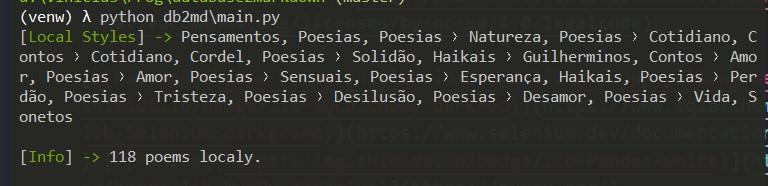

## 🐍✨ Escritor Python de Poesias para Markdown 📓✒
### [Read in English here](README-en.md).

Projeto python de acesso em base de dados e manipulação de arquivos.

[](https://creativecommons.org/licenses/by-nc-sa/4.0/legalcode)

[](https://www.psycopg.org/) [](https://www.sqlalchemy.org/) [](https://pandas.pydata.org/)



## Recursos

 - Cria pastas para cada categoria de poesia na base de dados;
 - Cria arquivos .md com as seguintes informações da base de dados:
   - Título;
   - Conteúdo do texto;
   - URL para texto;
   - Categoria;
   - Data de publicação;


# Executando 🏁

 1. Crie um arquivo `.env` na pasta raiz do repositório contendo as seguintes informações:

```python
# Caminho para a pasta alvo onde criar as poesias
root_folder_path =   # (p.ex. C:\Users\user\poesias)

# PostgreSQL
user_db =   # Usuário do Banco de Dados
password_db =   # Senha
host_db =   # Host (localhost)
port_db =   # Porta
database_db =   # Banco de Dados destino
```
 2. Instale as dependências e execute.

```
$ pip install -r requirements.txt
$ python db2md/main.py
```

# Teste 🚧

 - Instale as dependências de desenvolvedor.

```
$ pip install -r requirements-dev.txt
$ pytest db2md
```
